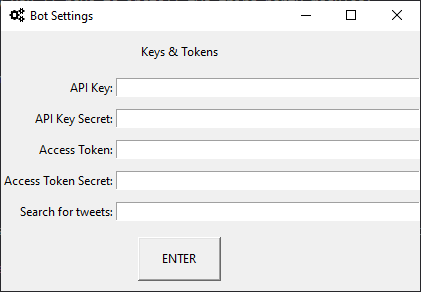
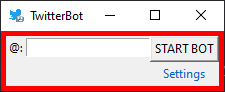
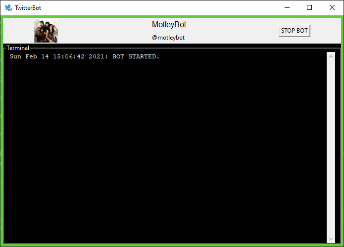

# 🐦 TwitterBot GUI

I originally coded Twitterbot to retweet all my friends' tweets that contained my name.
Seeing the potential 📈 of the project I made a GUI that requests only the required information  needed to create a Twitter bot. Now everyone can have their own bot for  free 🤑.
I believe 🙏 this will help marketing campaigns and companies advertisements.

The program is written in **Python3** using Twitter's API v1.1 to gather the data and execute the actions.


## 📚 Dependencies
In order to the script run correctly you'll have to install two third-party modules:
- Tweepy
- PIL

Just use the commands shown below in your terminal.
```
pip install tweepy Pillow
```

## ⚙️ How does it work

When running the script for the first time a "Bot Settings" window will appear for you to input the necessary data.



In the **Keys & Tokens** section you have to input the four required API Keys.

In the **Search for tweets** field you'll input the word you want the bot to interact with.

Hitting the **ENTER** button will create a "_settings.txt_" file which will storage all the previous data. "Bot Settings" will close automatically.



Now just input the @ and click START BOT. The border will turn green and a terminal will show up.



In case of errors a warning window will pop-up with more details. Feel free to modify the code.